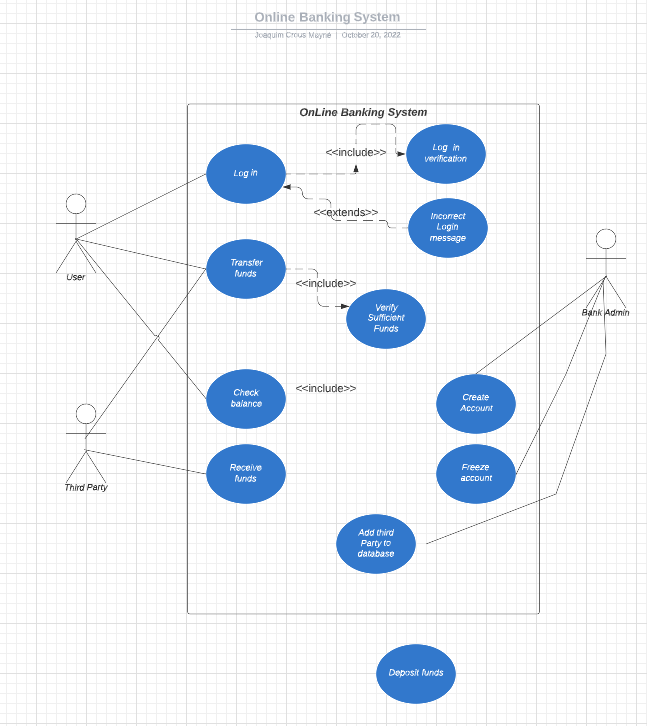
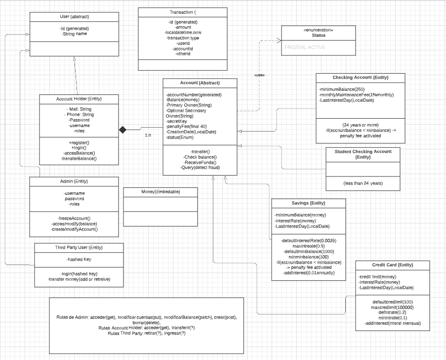

# Online-bank-Api (updated)

#### Update: I've made a docker-compose with a MySQL and a Java(amazoncorretto:17) image to create a composed container, so I can share the app without having to install anything, just Docker. I also have to delete the test in order to be able to create the jar file, because they needed to use the db and this isn't created yet. To run the program just put the terminal in the project directory and use this command:

~~~~
  docker-compose up
~~~~

#### This is my final project from the IronHack bootcamp. It's a RESTapi of Online Bank Api done with spring using some dependencies as Java dev tools, Security, Jdbc, Jpa, Web, MySQL, Lombock, validation and jackson. I didn't put many comments in my code to keep it clean hoping you can get all missing information here in the readme.

### Models
I've made three packages with different classes that represents:

- Package accounts: including an abstract parent class called Account with some common properties of all kind of accounts. Also, there are a model for: Checking Account, Credit Card, Saving Account and Student Checking Account.
- Package users: including an abstract parent class called User and its three child class Admin, Account Holder and Admin. It includes a model of Role( used for security purpose).
- Package transaction: a simple model that saves the information of all transactions made for the AccountHolders and Third Party.

### Enum
I have an Enum to indicate the two status that can be applied to account: ACTIVE and FROZEN.

### Embedables
I've used two embedables: the Money class(given by the project) and the Address class. 

### Repositories
A package containing all the repositories of all model classes.

### Security
This package contains the CustomUserDetails and the SecurityConfiguration classes used for security(Login accounts). 

### Service
This one contains all the services and interfaces relative to the models. In the AccountHolderService, AdminService and ThirdPartyUserService where are the methods with the logic needed to make functional the Api.

### Controllers
The controllers packages contains the different controllers used to connect the methods done in the services with an Url, so we can interact with the Api using a browser(or other apps that can help us with that interaction).

### Test
There I have three classes where I tested the different methods if they work correctly and if they throw the expected errors. There I also have tested the security because I've had to add a validation in the tests that was needed to prove the user was in the database. A few methods are not tested because I added them but aren't needed to make the api works.  

### Others

- A bankapi.sql with the schema, a pom.xml where are all the dependencies.

### Controllers Methods

- Account Holder Controller methods:
    - transfer money.
    - get Accounts.
    - add Primary Address.
    - add Mailing Address.
    - get Balance.

- Admin Controller methods:
    - modify balance.
    - change Status Account.
    - Create New User and New Account.
    - get All Users.
    - delete Account.
    - create New Account By User.

- Third Party User Controller methods:
    - charge Money

### Services Methods

- Account Holder Service methods:
    - transferMoneyByAccountType. This method get a big DTO that contains all the necessary info so the Account Holder can make the transference of money from an own account to another account.
    - getAccounts. This is used to display a list with all the accounts related to the Account Holder.
    - getBalance. This one is divided in sub-methods in order to apply the different monthly maintenance fees, interest rates and others.
    - addPrimaryAddress. The method is used to add a primary address to the user account.
    - addMailingAddress. The method is used to add a mail address to the user account.
    - checkFraud. This one is a sub-method used to detect fraud when someone is trying to make more than one transfer in less than a second.
    - checkStrangeAmount. The sub-method search in the transaction history to check if the amount of the transfer is more than 150% bigger than the historical max transfer.
    - checkUserName. Another sub-method used to check if the user is the owner of the account.

- Admin Service methods:
    - modifyBalance. This method allows the admin to modify (increase or decrease) the amount Balance of an account.
    - changeStatusAccount. This one is used to change the account's status.
    - getAllUsers. This display a list of all registered users.
    - deleteAccount. This one is to delete an account.
    - addSecondaryOwner. The method allows to add a secondary owner to an account.
    - createNewAccount. This one allows the admin to create a new user linked to a new account. It also allows to choose between the different account types that exist and if it's a checking account it switches between student and checking depending on the user's age. 
    - getAllAccounts. In this method is displayed a list of all accounts of the all users.
    - createThirdPartyUser. That is used to create a third party user with a personal hashed key.
    - addPassword. This method allows the admin to change the password of the user (not tested because I don't know if it's usefully).

- Third Party User methods:
    - transferMoneyByAccountType. It's the same method as the one in the account holder service, but it also asks to insert the hashed key in the headers to confirm the third party user identity.

## Use-Case & Class Diagram

## bank-api.postman_collection.json
- There is a list of all operations I've made in Postman to test that the authentication and all url worked correctly.

### Credits

Joaquim Crous Mayné - joaquimcrous@gmail.com

#### Special thanks to my colleagues and the IronHack crew for the whole bootcamp experience!
